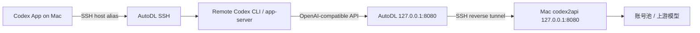
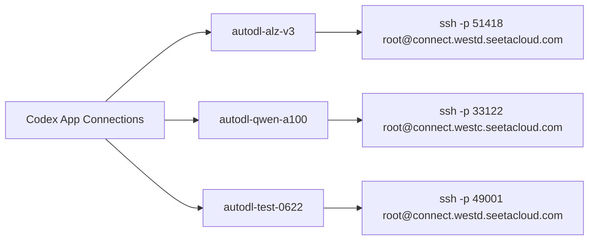
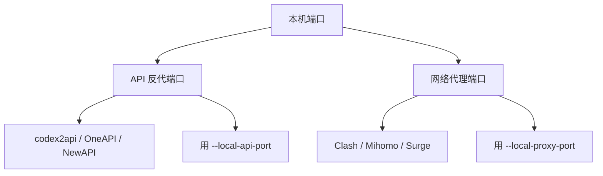

# codex2autodl

把 AutoDL 机器变成 Codex App 里的远程工作区，并让远端 Codex 通过你本机的 `codex2api` 账号池访问模型。

一句话理解：

```text
AutoDL 负责跑代码，Mac 负责提供模型入口；codex2autodl 负责把两边接成一根稳定的“电话线”。
```

默认推荐链路：

```text
Remote Codex -> AutoDL 127.0.0.1:8080 -> SSH 反向隧道 -> Mac codex2api 127.0.0.1:8080
```

`codex2api` 是 OpenAI-compatible API 反代，不是 Clash、Mihomo、Surge 这类网络代理。不要把它当成 `HTTPS_PROXY` 使用。



## 适合谁

- 你在 Mac 上用 Codex App。
- 你买了 AutoDL、SeetaCloud 或类似云 GPU 机器。
- 你希望 Codex 直接在远端机器上读代码、改文件、跑训练。
- 你本机已经有 `codex2api`、OneAPI、NewAPI 等 OpenAI-compatible API 服务。
- 你不想每次手动配 SSH key、远端 Codex、反向隧道、provider、登录状态和诊断。

## 它会做什么

把新 AutoDL 机器接进 Codex App，通常要做一串像“接水管”一样的步骤：先装接头，再通水，再查漏。

这个项目会自动完成：

| 步骤 | 做什么 | 类比 |
| --- | --- | --- |
| SSH key | 生成或复用 `~/.ssh/autodl_codex`，写入远端 `authorized_keys` | 给远端门锁配钥匙 |
| SSH alias | 写入本机 `~/.ssh/config` 的 `Host autodl-codex` | 给复杂号码存联系人 |
| Codex 安装 | 检查并安装远端 Codex CLI | 在远端机器放工具箱 |
| API 反代 | 配置 `model_provider = "codex2api"` | 告诉 Codex 去哪个窗口买票 |
| 反向隧道 | 把 AutoDL 的 `127.0.0.1:8080` 接回 Mac 的 `127.0.0.1:8080` | 从云机器牵一根回家网线 |
| watchdog | 守护隧道，断了自动重连 | 派人盯着电话线 |
| 诊断 | 跑本机和远端检查 | 水管打压测试 |

## 准备条件

本机需要：

- macOS。
- Codex App。
- `ssh`、`curl`、`expect`。
- 一个正在运行的 `codex2api` 或兼容服务，例如监听 `127.0.0.1:8080`。
- 一个对应的 API key。
- AutoDL 提供的 SSH 命令和密码，例如：

```bash
ssh -p 51418 root@connect.westd.seetacloud.com
```

先检查本机 API 端口是不是 OpenAI-compatible API：

```bash
curl -i http://127.0.0.1:8080/v1/models
```

如果看到 `401 Unauthorized`，通常是好事：说明服务活着，只是这条裸 `curl` 没带 key。

## 5 分钟上手

克隆仓库：

```bash
git clone https://github.com/wangbingnan136/codex2autodl.git
cd codex2autodl
```

运行交互式向导：

```bash
./scripts/setup-autodl-codex.sh --interactive --local-api-port 8080 --api-key-prompt
```

按提示输入：

```text
Connection alias, ASCII only [autodl-codex]: autodl-alz-v3
Paste AutoDL SSH command: ssh -p 51418 root@connect.westd.seetacloud.com
AutoDL SSH password (input hidden, not saved):
Remote Codex API key (codex2api mode uses your codex2api key; input hidden, not saved):
```

成功后，打开：

```text
Codex App -> Settings -> Connections
```

选择刚才的连接名，例如：

```text
autodl-alz-v3
```

如果诊断里看到类似结果，链路就是通的：

```text
model provider           codex2api
codex2api API base URL   http://127.0.0.1:8080/v1 reachable
18 ok · 0 warn · 0 fail ok
```

## 图形应用

### Rust 控制面板（推荐）

不想每次敲命令，可以直接启动 Rust 本地控制面板：

```bash
cargo run -- serve
```

默认会打开：

```text
http://127.0.0.1:8765
```

这个面板做三件事：

| 面板动作 | 背后做什么 | 类比 |
| --- | --- | --- |
| 保存服务器 | 把 alias、SSH 地址、端口写入 `~/.codex2autodl/profiles.json` | 通讯录保存联系人 |
| 保存密码/API key | 写入 macOS Keychain，不进项目文件 | 钥匙放保险柜 |
| 点击连接 | 调用同一套 setup/diagnose 流程，自动拉起 SSH key、provider 和隧道 | 按一下总闸，水管自动接好 |

已经由旧脚本写入 `~/.ssh/config` 的连接会在第一次打开面板时自动导入。旧连接的地址会保留；如果想真正一键连接，需要在面板里编辑该服务器并补存 SSH 密码。

删除面板里的服务器时，会同步删除本机 `~/.ssh/config`、`~/.ssh/codex2autodl/config` 中对应的 codex2autodl SSH Host 记录，并清掉 Codex 全局状态里同名的远程连接索引。也就是说，Codex App 设置页里的“来自此 Mac 的 SSH 连接”不会再留下同名旧历史。

如果想一次性清空所有 codex2autodl 写入过的 AutoDL SSH 历史：

```bash
cargo run -- clear-autodl-history
```

清理前会自动备份被改动的 SSH/Codex 配置，例如：

```text
~/.ssh/config.codex2autodl-backup-1783072616
~/.codex/.codex-global-state.json.codex2autodl-backup-1783081365
```

也可以构建成双击应用：

```bash
./scripts/build-macos-app.sh
open dist/codex2autodl-control.app
```

双击应用会启动同一个本地控制面板，并自动打开浏览器。默认端口是 `8765`；如果端口被占用，可以这样改：

```bash
CODEX2AUTODL_PORT=8777 open dist/codex2autodl-control.app
```

### 旧脚本仍然可用

Rust 控制面板现在是新的主入口，但底层仍保留原来的脚本能力。你仍然可以继续用命令行：

```bash
./scripts/setup-autodl-codex.sh \
  --alias autodl-alz-v3 \
  --ssh-password-prompt \
  --local-api-port 8080 \
  --api-key-prompt \
  --diagnose \
  "ssh -p 51418 root@connect.westd.seetacloud.com"
```

控制面板里对应的字段就是这条命令的图形化版本：连接名、SSH 命令、SSH 密码、本机 `codex2api` 端口、API key 和诊断开关。

Rust 面板在执行连接任务时，也会把 Keychain 里的密码/API key 临时写入 `0600` 文件，脚本结束后删除；命令行参数里不会直接暴露明文密钥。

## 常用命令

### 新 AutoDL 机器

推荐交互式：

```bash
./scripts/setup-autodl-codex.sh --interactive --local-api-port 8080 --api-key-prompt
```

也可以一行命令写完整：

```bash
./scripts/setup-autodl-codex.sh \
  --alias autodl-alz-v3 \
  --ssh-password-prompt \
  --local-api-port 8080 \
  --api-key-prompt \
  "ssh -p 51418 root@connect.westd.seetacloud.com"
```

### 只重建 API 隧道并诊断

Mac 睡眠、换网、AutoDL 实例重启后，旧 SSH 会话就像已经挂断的电话。脚本不能让旧电话原地复活，但可以帮你把下一通电话重新拨稳：

```bash
./scripts/setup-autodl-codex.sh --alias autodl-alz-v3 --local-api-port 8080 --diagnose
```

### 只更新 codex2api key

```bash
./scripts/setup-autodl-codex.sh --alias autodl-alz-v3 --local-api-port 8080 --api-key-prompt --diagnose
```

### 查看诊断

```bash
./scripts/setup-autodl-codex.sh --alias autodl-alz-v3 --diagnose
```

### 停止脚本托管的 API 隧道

```bash
./scripts/setup-autodl-codex.sh --alias autodl-alz-v3 --stop-api-tunnel
```

## alias 怎么取名

把 AutoDL SSH 地址看成电话号码，把 `--alias` 看成通讯录姓名：



建议：

| 场景 | alias 例子 | 说明 |
| --- | --- | --- |
| 只有一台默认机器 | `autodl-codex` | 最简单 |
| 某项目第 3 台机器 | `autodl-alz-v3` | 项目名 + 编号 |
| 按模型或 GPU 区分 | `autodl-qwen-a100` | 任务 + GPU |
| 临时测试机器 | `autodl-test-0622` | 用途 + 日期 |

alias 只能包含英文字母、数字、点、下划线和短横线。不要用中文、空格或括号。

判断是否要换 alias：

| 你想做什么 | 应该怎么做 |
| --- | --- |
| 旧机器不要了，新机器继续叫同一个名字 | 复用同一个 alias 重新跑脚本 |
| 旧机器还要保留，新机器也要能选 | 给新机器一个新 alias |
| 同一台机器端口变了，但逻辑上还是同一台 | 复用同一个 alias |
| 想同时连多台 AutoDL | 每台一个不同 alias |

## API 端口和代理端口不要混

这里最容易踩坑。`codex2api` 是 API 反代，Clash/Mihomo/Surge 是网络代理。它们都可能叫“代理”，但用途完全不同。



如果：

```bash
curl -i http://127.0.0.1:8080/v1/models
```

返回 `401 Unauthorized`，通常说明这是 API 反代端口，用：

```bash
./scripts/setup-autodl-codex.sh --local-api-port 8080 --api-key-prompt --diagnose
```

只有当它确实是 Clash/Mihomo/Surge 这类网络代理端口时，才用：

```bash
./scripts/setup-autodl-codex.sh --local-proxy-port 7890 --diagnose
```

## 脚本写了什么

本机 `~/.ssh/config` 会出现类似配置：

```sshconfig
Host autodl-alz-v3
  HostName connect.westd.seetacloud.com
  User root
  Port 51418
  IdentityFile ~/.ssh/autodl_codex
  IdentitiesOnly yes
  ServerAliveInterval 15
  ServerAliveCountMax 8
  TCPKeepAlive yes
  IPQoS none
  ConnectTimeout 15
  ControlMaster auto
  ControlPath ~/.ssh/codex2autodl-%C.sock
  ControlPersist 10m
```

远端 `~/.codex/config.toml` 会出现类似配置：

```toml
model_provider = "codex2api"
model_reasoning_effort = "xhigh"

[model_providers.codex2api]
name = "codex2api"
base_url = "http://127.0.0.1:8080/v1"
wire_api = "responses"
requires_openai_auth = true
```

重写 provider 时会先清掉旧的 `model` / `model_provider` / `model_catalog_json` 行再重写：如果你在面板里填了“默认模型”，就写死成那个值；没填就交给当前 Codex App/CLI 选择。若老服务器的模型列表仍停在旧版本，重新点一次“连接”会同时升级远端 Codex；“修复隧道”只负责把隧道接通。

`requires_openai_auth = true` 表示复用 Codex 的 API key 登录缓存。因为请求已经发到 `codex2api`，这里的 key 应该是你的 `codex2api` key，不是 OpenAI 官方 key。

## 反代任意 provider（不止 codex2api）

远端 provider 现在是可配置的，不再写死 `codex2api`。面板“新增/编辑服务器”里新增了四个字段：

| 字段 | 作用 | 例子 |
| --- | --- | --- |
| Provider 名称 | 写进远端 `model_provider` 和 `[model_providers.*]` 段名 | `claude-code-router` |
| Wire API | provider 的协议，OpenAI Responses 用 `responses`，普通 Chat 用 `chat` | `responses` |
| 默认模型 | 直接写死远端 `model`，换模型不用重连才生效 | `codex2api/gpt-5.5` |
| 模型 catalog 文件 | 本机 JSON 路径，连接时上传到远端并写 `model_catalog_json`，让 App 列出正确的模型 | `~/.codex/ccr-model-catalog.json` |

这几件事最终写进远端 `~/.codex/config.toml`：

```toml
model_provider = "claude-code-router"
model = "codex2api/gpt-5.5"
model_catalog_json = "/root/.codex/codex2autodl-model-catalog.json"

[model_providers.claude-code-router]
name = "claude-code-router"
base_url = "http://127.0.0.1:18990/v1"
wire_api = "responses"
requires_openai_auth = true
```

关键点：base_url 由“本地 API 端口”自动推出来（`http://127.0.0.1:<远端端口>/v1`），所以你只要填**本地服务的端口 + key**，隧道和 provider 会一起接好。

### 例子：反代 claude-code-router（CCR）

CCR 监听 `127.0.0.1:18990`，key 是 CCR 自己生成的 `ccr-profile-...`（**别手抄**，从
`~/.claude-code-router/profiles/<profile>/codex/config.toml` 里读当前值，它会轮换）。CCR 的模型名必须带命名空间，例如
`codex2api/gpt-5.5`、`kiro-rs/claude-fable-5`，裸 `gpt-5.5` 会 `All target providers failed`。

命令行版本：

```bash
./scripts/setup-autodl-codex.sh \
  --alias autodl-ccr \
  --ssh-password-prompt \
  --local-api-port 18990 \
  --api-provider-name claude-code-router \
  --wire-api responses \
  --model codex2api/gpt-5.5 \
  --model-catalog-file ~/.codex/ccr-model-catalog.json \
  --api-key-file /path/to/ccr.key \
  --diagnose \
  "ssh -p 51418 root@connect.westd.seetacloud.com"
```

`--api-provider-name / --wire-api / --model / --model-catalog-file` 都是可选的：不填就沿用默认的 `codex2api` + `responses`，行为和以前一致。

CCR 默认使用它实时维护的 `~/.codex/ccr-model-catalog.json`。codex2autodl 会在每次点“连接”时把当前文件上传到远端；模型变化后重新点一次“连接”即可刷新菜单，“修复隧道”只接通网络，不刷新模型目录。

## 常见问题

### Codex App 一直重连

先跑诊断：

```bash
./scripts/setup-autodl-codex.sh --alias autodl-alz-v3 --diagnose
```

重点看：

```text
== local managed tunnels
api tunnel watchdog: running pid=...
api tunnel: healthy remote 127.0.0.1:8080
```

watchdog 由 macOS `launchd` 托管；它会守着 SSH 反向隧道，断了自动重连。健康检查优先看 SSH control socket，不依赖 AutoDL 远端有 `python3`。

如果 watchdog 不在，重新拉起 LaunchAgent：

```bash
./scripts/setup-autodl-codex.sh --alias autodl-alz-v3 --local-api-port 8080 --diagnose
```

如果诊断是 `18 ok · 0 warn · 0 fail ok`，但 Codex App 还在重连，通常是 App 当前那条 SSH 会话已经断了。断开后重新选择对应 alias。

### `/v1/models` 返回 401

正常。裸 `curl` 没带 API key，服务拒绝你，但这也证明服务在响应。

真正要看的是 `codex doctor` 是否显示 active provider 可达。

### `invalid_api_key`

key 要跟 provider 对上：

```text
openai provider    -> OpenAI 官方 API key
codex2api provider -> codex2api 反代 API key
```

重新写入：

```bash
./scripts/setup-autodl-codex.sh --alias autodl-alz-v3 --local-api-port 8080 --api-key-prompt --diagnose
```

### Codex App 说需要密码

说明 SSH 免密没成功。先在 Terminal 里测试：

```bash
ssh autodl-alz-v3
```

如果这里还问密码，Codex App 也会失败。重新跑新机器设置流程，让脚本用 AutoDL 密码写一次公钥。

### Codex App 说远端没安装 Codex

重新跑：

```bash
./scripts/setup-autodl-codex.sh \
  --alias autodl-alz-v3 \
  --local-api-port 8080 \
  "ssh -p 新端口 root@新host"
```

脚本会检查远端 `codex`，缺失或版本旧时会安装。

### AutoDL 机器很卡

诊断里看 `load average`。网络通不代表机器响应快；GPU 训练、解压数据、pip 编译依赖都可能让 SSH 和 Codex app-server 变慢。

## 安全说明

- AutoDL 密码只用于首次写 SSH 公钥，脚本不保存。
- Rust 控制面板会把已保存的 SSH 密码和 API key 放进 macOS Keychain，本地 `profiles.json` 只保存地址、端口、备注这类非密钥信息。
- `codex2api` key 会写入远端 Codex 登录缓存 `~/.codex/auth.json`，它等同于密码，不要提交、不要贴到聊天里。
- 本机私钥在 `~/.ssh/autodl_codex`，不要共享。
- 图形应用的临时密钥文件权限是 `0600`，脚本结束后删除。
- 公开仓库默认不提交 `build/`、`dist/`、`.DS_Store`、日志和本地密钥文件。

## 命令速查

```bash
# 新 AutoDL，完整设置
./scripts/setup-autodl-codex.sh --interactive --local-api-port 8080 --api-key-prompt

# 新 AutoDL，并保存成指定连接名
./scripts/setup-autodl-codex.sh --alias autodl-alz-v3 --ssh-password-prompt --local-api-port 8080 --api-key-prompt "ssh -p 端口 root@host"

# 重建 8080 API 隧道并诊断
./scripts/setup-autodl-codex.sh --alias autodl-alz-v3 --local-api-port 8080 --diagnose

# 只更新反代 API key
./scripts/setup-autodl-codex.sh --alias autodl-alz-v3 --local-api-port 8080 --api-key-prompt --diagnose

# 查看诊断
./scripts/setup-autodl-codex.sh --alias autodl-alz-v3 --diagnose

# 清空 codex2autodl 写入的 AutoDL SSH/Codex 远程历史
cargo run -- clear-autodl-history

# 停止 8080 API 隧道和 watchdog
./scripts/setup-autodl-codex.sh --alias autodl-alz-v3 --stop-api-tunnel

# 停止网络代理隧道
./scripts/setup-autodl-codex.sh --alias autodl-alz-v3 --stop-proxy-tunnel
```

## 项目结构

```text
.
├── Cargo.toml
├── assets/
│   └── codex2autodl-control-icon-source.png
├── scripts/
│   ├── build-macos-app.sh
│   └── setup-autodl-codex.sh
├── src/
│   ├── http.rs
│   ├── main.rs
│   ├── paths.rs
│   ├── profile.rs
│   ├── runner.rs
│   ├── secrets.rs
│   ├── ssh.rs
│   └── static/
│       ├── app.css
│       ├── app.js
│       └── index.html
└── README.md
```

## 许可

这个仓库目前未声明开源许可证。公开可见不等于自动授予复制、分发或商用授权。
